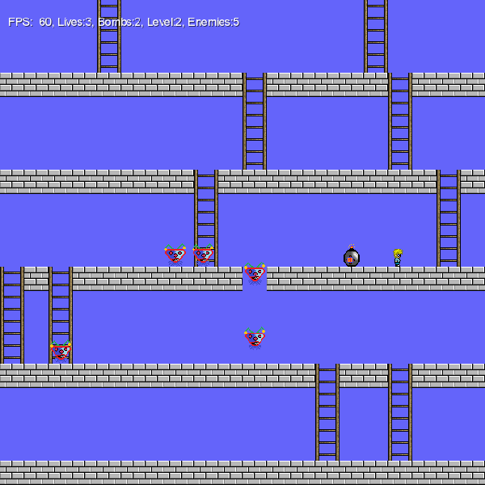

# libgdx-panic

A retro game is written with LibGdx inspired by Panic for C-64 which was written by Ian Gray

[See more info and try it out in the project page.](peterborkuti.github.io/libgdx-panic)
